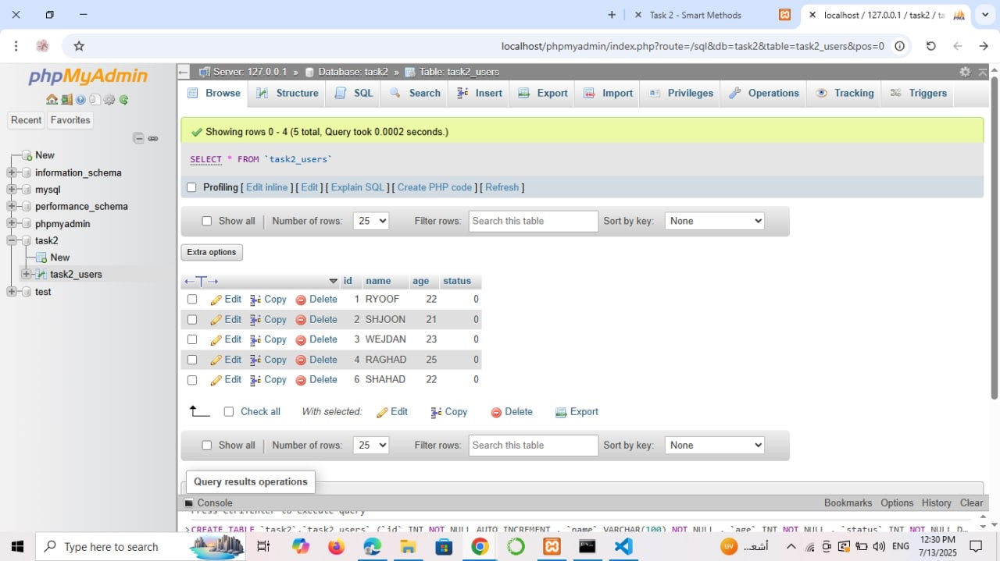
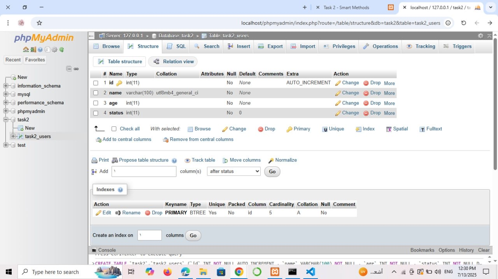
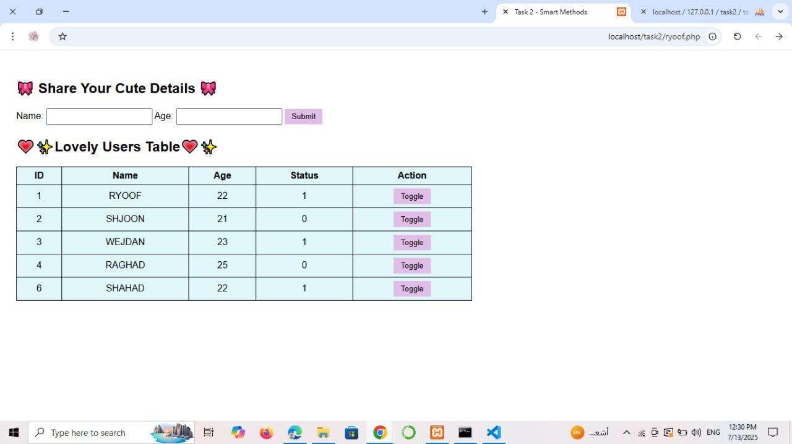
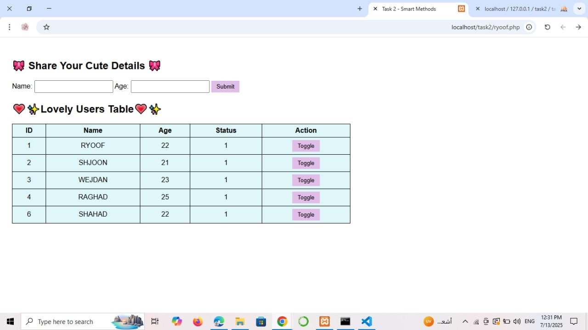
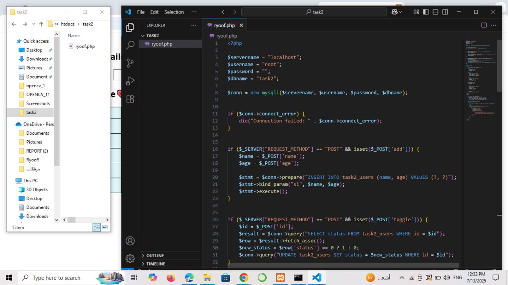

# 🎀 Task 2 - Cute User Form with PHP & MySQL 🎀

This project demonstrates a simple PHP web form connected to a MySQL database, allowing users to submit their name and age. Submitted users are displayed in a table, with an option to toggle their status between 0 and 1.

---

## ✨ Features

- Add users using a cute form 🎀
- Display all users in a styled table 💕
- Toggle user status (0 / 1) dynamically using PHP & MySQL
- Fully functional local setup using XAMPP

---

## 📸 Screenshots

### 1️⃣ 📝 Database Table View
Displays all users inserted into the `task2_users` table.

### 2️⃣ ⚙️ Table Structure in phpMyAdmin
Shows the table schema and data types for each column.

### 3️⃣ 🌸 Form Interface - Initial
Before clicking toggle buttons (all status = 0).

### 4️⃣ 🌼 Some Statuses Toggled
A few users have their status set to 1.

### 5️⃣ 🌟 All Statuses Toggled
All users have status = 1.

### 6️⃣ 💻 Code in VS Code
Main PHP logic (form, insert, and toggle).

---

## 💻 Code Snippet (PHP)

The code is located in `ryoof.php`. It contains:
- MySQL connection using `mysqli`
- Form submission logic
- Toggle logic for the user status

📍 You can view it in the screenshot above or open `ryoof.php` directly.

---

## 🗂️ Files Required

- `ryoof.php`
- MySQL database `task2` with table `task2_users`
- Local server (e.g., XAMPP)

---

## ✅ How to Run

1. Start Apache & MySQL via XAMPP
2. Place `ryoof.php` inside `htdocs/task2`
3. Create the database and table using phpMyAdmin
4. Open browser and go to: `localhost/task2/ryoof.php`
5. Start submitting and toggling! 🎉

---

## ✨Created By

**🪄✨Ryoof Dukhailallah Almalki🪄✨**  
